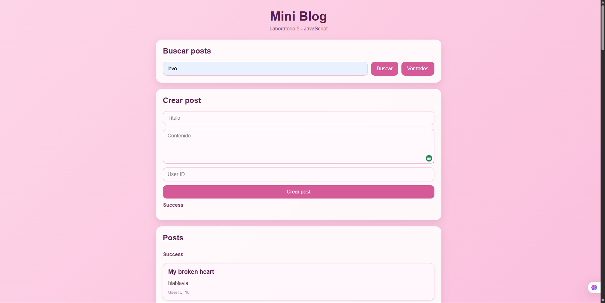

# Lab 5 - JavaScript

## Description
This laboratory project is a simple web application built with **HTML**, **CSS**, and **JavaScript**.  
Its purpose is to practice JavaScript fundamentals, DOM manipulation, event handling, and basic interactive behavior without using external frameworks or libraries.


## Technologies Used
- HTML5
- CSS3
- JavaScript 


## Project Structure
```text
Lab-5-JS/
│── index.html
│── style.css
│── script.js
│── README.md
│── .gitignore
│── Screenshot1.png
```

## Installation Guide
To run this project locally, follow these steps:

1. Clone the repository:
   ```bash
   git clone https://github.com/itsadrimartinezzz/Lab-5-JS.git
   ```

2. Open the project folder:
   ```bash
   cd Lab-5-JS
   ```

3. Open the `index.html` file in your browser.

You can also use Visual Studio Code with the Live Server extension.

## How to Use
1. Open the webpage in your browser.
2. Interact with the available interface elements.
3. Test the dynamic behavior implemented with JavaScript.

## Deployment
This project was deployed using **GitHub Pages**.

https://itsadrimartinezzz.github.io/Lab-5-JS/

## Screenshots

### Project Screenshot



## Video
https://www.canva.com/design/DAHELoLanbU/aywZhzHZMXh1Sux86zCpJw/edit?utm_content=DAHELoLanbU&utm_campaign=designshare&utm_medium=link2&utm_source=sharebutton
